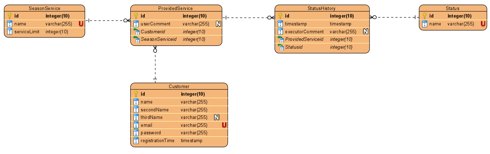

## Тестовое задание для Smart consulting – оказание сезонных услуг - **Fakeuslugi**

## Действующая версия
Текущая действующая версия приложения доступна публично по адресу:
http://176.118.165.246:8080

# Запуск на Tomcat 9
- из каталога проекта выполнить команду:
```
mnv clean package
```
- файл `target/ROOT.war` переместить в каталог с установленным Tomcat `TOMCAT_DIR/webapps`
- запустить Tomcat, выполнив `bin/startup.bat` или `bin/startup.sh`
- приложение будет доступно по корневому пути сервера Tomcat. Для локально запущенного экземпляра сервера с настройками по умолчанию это:
```
http://localhost:8080
``` 
- если необходим адрес отличный от корневого, то в файле `pom.xml` в тегах:
 ```
<plugin>
    <groupId>org.apache.maven.plugins</groupId>
    <artifactId>maven-war-plugin</artifactId>
    <version>3.3.2</version>
    <configuration>
        <warName>ROOT</warName>
    </configuration>
</plugin>
```

исправить содержимое тега `warName` на необходимый путь к приложению

# Описание
## Задание
[Содержимое задния pdf](docs/Test task JAVA.pdf)
## Общие решения
- Приложение выполнено на Spring Framework 5
- В качестве базы данных использована PostgreSQL
- Взаимодействие с БД через Hibernate
- Пользовательский веб-интерфейс реализован на связке JSP + Javascript + AngularJS

**Фронтенд проработан поверхностно и служит исключительно для демонстрации/проверки работоспособности бэкенд части**

Примечание про UI: В задании указывается, что пользователь в форме оказания услуги указывает ФИО и пр.
Но благодаря авторизации мы уже знаем, кто наш пользователь, поэтому его ФИО и почта подтягиваются автоматически. А сам пользователь может от себя добавить какой-нибудь комментарий при подаче заявки (вместо этого поля при необходимости можно было бы добавить несколько полей), но я просто показал, что такая возможность реализована и работает.


### База данных
ERD диаграмма БД представлена на рисунке ниже:


Описание отношений:
- SeasonService - таблица с информацией об оказываемых сезонных услугах
- Status - таблица возможных статусов оказываемой сезонной услуги
- Customer - хранит информацию о зарегистрированном пользователе
- StatusHistory - история оказания услуги
- ProvidedService - информация об оказываемой услуге

Хотя этого и не было в задании, но БД предусматривает возможность предоставления сезонной услуги, которая не может быть оказана мгновенно, а проходит через несколько этапов (например "Получена", "Рассматривается" и т.д.)
Вся информация о датах и времени предоставления услуги хранится в StatusHistory

Тем не менее, в текущей реализации приложения все предоставляемые услуги оказываются мгновенно, статус устанавливается автоматически. Но возможность установки статусов в БД есть. Для реализации данного функционала необходима доработка остальных уровней приложения в части методов АПИ установки статуса и дополнения соответствующей прикладной логики

Список доступных услуг и их лимит задается через свойство в [application.properties](src/main/resources/config/application.properties) `season_service_map`
Список статусов в `status_list`

#### Hibernate
Взаимодействие с БД осуществляется с помощью JPA, реализованный в Hibernate
Запросы в БД формируются в классах с постфиксом ...Dao в формате HQL. Дальнейшая работа возложена на библиотеку Hibernate.

Ввиду относительно большого количества однообразных простых запросов вида `from table where a = b` реализован паттерн проектирования "Шаблонный метод" (aka Скелетная реализация).
Данный паттерн позволяет избежать повторения однообразных строчек кода при выполнении запросов в БД.
Реализация размещена в отдельном пакете [com.fakeuslugi.daoutil](src/main/java/com/fakeuslugi/daoutil)

Проектный шаблон разработан "на скорую руку" и нуждается в расширении и доработке.

### Уровень прикладной логики
Вся прикладная логика реализована в бине [OrderService](src/main/java/com/fakeuslugi/seasonservice/OrderService.java)

Основной его функцией является разбор запросов от контроллеров, обращение к уровню БД, приведение результата в формат Data transfer object

Data transfer object в данном приложении выполняет 2 функции:
- маппинг запроса клиента в POJO объект с помощью функционала встроенных компонентов Spring (аннотация @RequestBody)
- "упаковка" данных полученных сервисным слоем от БД в POJO объект для дальнейшей отправки клиенту

Последняя функция реализована через конструктор DTO классов, в которые передаются (как правило) JPA сущности (@Entity).
Конструкторы DTO принимают определенные интерфейсы, которые должны быть реализованы в используемых сущностях. Это сделано по двум причинам:
1. Ослабить связь между JPA сущностями и DTO объектами, тем самым обеспечив возможность безопасной модификации тех и других
2. Навязать контракт к реализации сущностей, для сохранения их совместимости с конструктором DTO.

Для целей аутентификации и авторизации служит вспомогательный сервисный бин:
[CustomerService](src/main/java/com/fakeuslugi/security/CustomerService.java)

  

Отправка почты реализована в компоненте [EmailService](src/main/java/com/fakeuslugi/seasonservice/EmailService.java)
Отправка проверялась на 2-х сервисах yandex и inbox.lv. Ни на одном из них не получилось успешно отправить. В первом случае приходит ответ, что недостаточно прав, а во втором - неправильный логин/пароль. При наличии достаточного времени эту проблему можно было бы решить, но пока она не решена.

### REST API, контроллеры
Данные между клиентом и сервером передаются в формате JSON.
Модели передаваемых данных закреплены в DTO объектах. Все DTO объекты собраны в пакете [com.fakeuslugi.controller.dto](src/main/java/com/fakeuslugi/controller/dto)

Для нужд прикладной логики реализованы 3 метода АПИ:
- GET /service/list - получить список доступных сезонных услуг
- POST /service/order - заказать сезонную услугу 
- GET /service/orders - получить список всех оказанных услуг

Можно было бы сделать отдельный метод АПИ для получения информации по конкретной услуге, но в текущей ситуации я такой потребности не вижу. Кроме того, используя предлагаемый подход, мы сокращаем количество обращений клиента к серверу, а также уменьшаем количество разработки, поскольку нет необходимости проверять запрашиваемый ордер на принадлежность к данному пользователю (в методе АПИ orders мы получаем все оказанные услуги для текущего пользователя)

Для аутентификации:
- POST /auth/register
- POST /auth/login

Вспомогательные методы для ajax запросов клиента:
- GET /ajax/orderlist
- GET /ajax/order
- GET /ajax/history
- GET /ajax/auth

В приложении используется stateless аутентификация. К http запросам клиент прикрепляет заголовок Authorization с полученным в процессе аутентификации JWT токеном

Тестовые запросы к АПИ приведены в файле [test_requests.http](http_test/test_requests.http). Файл можно открыть в VS Code с установленным плагином REST clietn и отправлять запросы непосредственно из него.

### Properties
Основные настройки приложения содержатся в [application.properties](src/main/resources/config/application.properties)

Настройки логирования в [log4j2.properties](src/main/resources/log4j2.properties)

### Инициализация
При запуске приложения производится проверка БД на целостность компонентом [DatabaseCheck](src/main/java/com/fakeuslugi/DatabaseCheck.java), наличие новых услуг, статусов и пр. При неуспешной проверке приложение не запускается